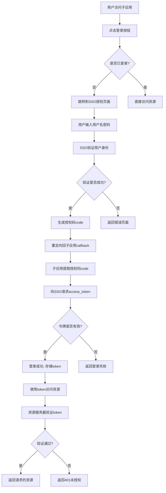

# 极简 OAuth2.0 应用授权登录流程分析

## 流程推演

### 1. 用户点击登录按钮

**当前页面**：`https://note1.szzbn.cn/pages/tab/user/index`

**跳转动作**：

```
用户点击登录按钮 →
跳转到：https://account.szzbn.cn/login
携带参数：
  callback=https://note1.szzbn.cn/pages/tab/user/index
  state=1
```

**完整跳转 URL**：

```
https://account.szzbn.cn/login?callback=https://note1.szzbn.cn/pages/tab/user/index&state=1
```

### 2. SSO 登录页面处理

**访问页面**：`https://account.szzbn.cn/login?callback=https://note1.szzbn.cn/pages/tab/user/index&state=1`

**处理流程**：

1. 用户输入用户名和密码
2. 验证成功后，检查是否有`callback`参数
3. 如果有`callback`，调用获取授权码(code)接口
4. 生成授权码：`code(ABC)`

### 3. 重定向回子应用

**重定向动作**：

```
授权成功后重定向到：
callback参数值 + code参数

即：https://note1.szzbn.cn/pages/tab/user/index?code=ABC&state=1
```

### 4. 子应用处理授权码

**页面接收**：`https://note1.szzbn.cn/pages/tab/user/index?code=ABC&state=1`

**处理流程**：

1. 判断页面 URL 中是否有`code`参数
2. 如果有`code`，发起 API 登录请求
3. 请求参数包含授权码`code`
4. 获取`access_token`和`refresh_token`
5. 登录完成

---

## 服务端校验与核心逻辑

### 1. 回调地址校验

```javascript
// 验证回调地址是否为有效注册地址
function validateCallbackUri(callbackUri) {
  const registeredUris = [
    'https://note1.szzbn.cn',
    'https://note2.szzbn.cn',
    // ... 其他已注册的子应用地址
  ];

  return registeredUris.some((uri) => callbackUri.startsWith(uri));
}
```

### 2. State 参数安全校验

```javascript
// 生成安全的state参数
function generateSecureState() {
  const timestamp = Date.now();
  const random = Math.random().toString(36).substr(2);
  return `${timestamp}_${random}`;
}

// 验证state参数
function validateState(state) {
  const [timestamp] = state.split('_');
  const now = Date.now();
  // 检查state是否在有效期内（5分钟内）
  return now - parseInt(timestamp) < 5 * 60 * 1000;
}
```

### 3. 核心处理逻辑

#### **SSO 页面（授权服务器）逻辑**：

```javascript
// 判断URL是否有callback参数
function hasCallbackInUrl() {
  const urlParams = new URLSearchParams(window.location.search);
  return urlParams.has('callback');
}

// 获取授权码
function getAuthorizationCode() {
  return generateRandomCode(); // 生成随机授权码
}

// 重定向回子应用
function redirectToCallback(callbackUrl, code, state) {
  const redirectUrl = `${callbackUrl}?code=${code}&state=${state}`;
  window.location.href = redirectUrl;
}
```

#### **子应用页面逻辑**：

```javascript
// 判断页面路径是否有code参数
function hasCodeInUrl() {
  const urlParams = new URLSearchParams(window.location.search);
  return urlParams.has('code');
}

// API登录请求
async function loginWithCode(code) {
  const response = await fetch('/api/auth/login', {
    method: 'POST',
    headers: {
      'Content-Type': 'application/json',
    },
    body: JSON.stringify({ code }),
  });

  const data = await response.json();
  return {
    access_token: data.access_token,
    refresh_token: data.refresh_token,
  };
}
```

---

## 整体流程概述

```
子应用（A） → 跳转到授权服务器（B） → 授权服务器（B） → 跳转回子应用（A）
      ↓                                                          ↓
用户点击登录                         用户输入凭据               子应用获取授权码
      ↓                                                          ↓
携带callback参数                   生成授权码code             向授权服务器请求令牌
      ↓                                                          ↓
重定向到SSO                        重定向回callback          使用令牌访问资源
```

### 详细流程图



---

## 实现细节

### 1. 子应用 → 跳转到授权服务器

**HTML 实现**：

```html
<!-- 登录按钮 -->
<a
  href="https://account.szzbn.cn/authorize?client_id=your_client_id&redirect_uri=https://note1.szzbn.cn/auth/callback&response_type=code&state=secure_state_value&scope=read"
>
  使用SSO登录
</a>
```

**JavaScript 实现**：

```javascript
function redirectToSSO() {
  const clientId = 'your_client_id';
  const redirectUri = encodeURIComponent('https://note1.szzbn.cn/auth/callback');
  const state = generateSecureState();

  const authUrl = `https://account.szzbn.cn/authorize?
    client_id=${clientId}&
    redirect_uri=${redirectUri}&
    response_type=code&
    state=${state}&
    scope=read_write`;

  // 存储state用于后续验证
  localStorage.setItem('oauth_state', state);

  window.location.href = authUrl;
}
```

**参数说明**： | 参数 | 必填 | 说明 | |------|------|------| | client_id | 是 | 应用标识 | | redirect_uri | 是 | 回调地址，必须与应用注册时的一致 | | response_type | 是 | 固定为`code` | | state | 是 | 随机字符串，防止 CSRF 攻击 | | scope | 否 | 请求的权限范围 |

### 2. 授权服务器 → 跳转回子应用

**SSO 服务器响应**：

```javascript
// SSO服务器处理登录成功后
app.post('/authorize', (req, res) => {
  const { username, password, client_id, redirect_uri, state } = req.body;

  // 验证用户凭据
  const isValid = validateCredentials(username, password);

  if (isValid) {
    // 生成授权码
    const authCode = generateAuthCode(client_id, username);

    // 重定向回子应用
    const redirectUrl = `${redirect_uri}?code=${authCode}&state=${state}`;
    res.redirect(302, redirectUrl);
  } else {
    res.status(401).send('Authentication failed');
  }
});
```

### 3. 子应用获取授权码

**回调页面处理**：

```javascript
// 回调页面代码（如：/auth/callback）
document.addEventListener('DOMContentLoaded', () => {
  const urlParams = new URLSearchParams(window.location.search);
  const code = urlParams.get('code');
  const state = urlParams.get('state');

  // 验证state防止CSRF
  const savedState = localStorage.getItem('oauth_state');
  if (state !== savedState) {
    console.error('State mismatch, possible CSRF attack');
    return;
  }

  // 清除存储的state
  localStorage.removeItem('oauth_state');

  if (code) {
    // 使用code交换token
    exchangeCodeForToken(code);
  } else {
    console.error('No authorization code received');
  }
});
```

### 4. 子应用向授权服务器请求令牌

**令牌交换接口**：

```javascript
async function exchangeCodeForToken(code) {
  try {
    const response = await fetch('https://account.szzbn.cn/token', {
      method: 'POST',
      headers: {
        'Content-Type': 'application/x-www-form-urlencoded',
      },
      body: new URLSearchParams({
        grant_type: 'authorization_code',
        code: code,
        redirect_uri: 'https://note1.szzbn.cn/auth/callback',
        client_id: 'your_client_id',
        client_secret: 'your_client_secret',
      }),
    });

    if (!response.ok) {
      throw new Error(`Token request failed: ${response.status}`);
    }

    const tokenData = await response.json();

    // 存储token
    localStorage.setItem('access_token', tokenData.access_token);
    localStorage.setItem('refresh_token', tokenData.refresh_token);
    localStorage.setItem('expires_in', Date.now() + tokenData.expires_in * 1000);

    // 重定向到原始页面
    const originalPath = localStorage.getItem('original_path') || '/';
    window.location.href = originalPath;
  } catch (error) {
    console.error('Failed to exchange code for token:', error);
    // 显示错误提示
    showErrorMessage('登录失败，请重试');
  }
}
```

**响应数据结构**：

```json
{
  "access_token": "eyJhbGciOiJIUzI1NiIsInR5cCI6IkpXVCJ9...",
  "token_type": "bearer",
  "expires_in": 3600,
  "refresh_token": "def50200ae5b4d8c...",
  "scope": "read write"
}
```

### 5. 子应用使用令牌访问资源

**带令牌的 API 请求**：

```javascript
async function fetchWithToken(url, options = {}) {
  const token = localStorage.getItem('access_token');

  if (!token) {
    // 如果无token，重定向到登录
    redirectToLogin();
    return;
  }

  const headers = {
    Authorization: `Bearer ${token}`,
    'Content-Type': 'application/json',
    ...options.headers,
  };

  try {
    const response = await fetch(url, { ...options, headers });

    // 如果token过期，尝试刷新
    if (response.status === 401) {
      const refreshed = await refreshAccessToken();
      if (refreshed) {
        // 重试原请求
        return fetchWithToken(url, options);
      } else {
        // 刷新失败，需要重新登录
        redirectToLogin();
        return;
      }
    }

    return response;
  } catch (error) {
    console.error('API request failed:', error);
    throw error;
  }
}

// 使用示例
async function getUserNotes() {
  const response = await fetchWithToken('https://api.note1.szzbn.cn/notes');
  if (response.ok) {
    const notes = await response.json();
    return notes;
  }
  return null;
}
```

**令牌刷新机制**：

```javascript
async function refreshAccessToken() {
  const refreshToken = localStorage.getItem('refresh_token');

  if (!refreshToken) {
    return false;
  }

  try {
    const response = await fetch('https://account.szzbn.cn/token', {
      method: 'POST',
      headers: {
        'Content-Type': 'application/x-www-form-urlencoded',
      },
      body: new URLSearchParams({
        grant_type: 'refresh_token',
        refresh_token: refreshToken,
        client_id: 'your_client_id',
        client_secret: 'your_client_secret',
      }),
    });

    if (response.ok) {
      const tokenData = await response.json();

      // 更新存储的token
      localStorage.setItem('access_token', tokenData.access_token);
      localStorage.setItem('refresh_token', tokenData.refresh_token);
      localStorage.setItem('expires_in', Date.now() + tokenData.expires_in * 1000);

      return true;
    }
  } catch (error) {
    console.error('Failed to refresh token:', error);
  }

  return false;
}
```

---

## 安全注意事项

### 1. 防止 CSRF 攻击

```javascript
// 生成和验证CSRF token
const csrfToken = generateCSRFToken();
// 存储在session或cookie中
```

### 2. 防止重放攻击

```javascript
// 使用nonce
const nonce = generateNonce();
// 验证nonce是否已使用过
```

### 3. 安全存储 token

```javascript
// 建议使用httpOnly cookie存储token
// 或者使用浏览器的安全存储API
if ('crypto' in window) {
  // 使用Web Crypto API加密存储
}
```

### 4. 输入验证

```javascript
function sanitizeInput(input) {
  // 移除危险字符
  return input.replace(/[<>]/g, '');
}
```

### 5. 错误处理

```javascript
try {
  // OAuth操作
} catch (error) {
  // 记录日志但不泄露敏感信息
  console.error('OAuth error:', error);
  // 返回通用错误信息
  showErrorMessage('认证过程发生错误');
}
```

---

## 部署配置

### Nginx 配置示例

```nginx
server {
    listen 443 ssl;
    server_name note1.szzbn.cn;

    ssl_certificate /path/to/cert.pem;
    ssl_certificate_key /path/to/key.pem;

    location /auth/callback {
        # 回调地址需要允许跨域
        add_header 'Access-Control-Allow-Origin' 'https://account.szzbn.cn';
        add_header 'Access-Control-Allow-Methods' 'GET, POST, OPTIONS';
        proxy_pass http://localhost:3000;
    }

    location / {
        proxy_pass http://localhost:3000;
    }
}
```

### 环境变量配置

```bash
# .env文件
CLIENT_ID=your_client_id
CLIENT_SECRET=your_client_secret
REDIRECT_URI=https://note1.szzbn.cn/auth/callback
AUTH_SERVER=https://account.szzbn.cn
TOKEN_ENDPOINT=/token
AUTHORIZE_ENDPOINT=/authorize
```

---

## 测试用例

### 1. 正常流程测试

```javascript
describe('OAuth2.0 Flow', () => {
  it('should complete full OAuth flow', async () => {
    // 1. 点击登录按钮
    await page.click('#login-btn');

    // 2. 验证跳转到SSO
    expect(page.url()).toContain('account.szzbn.cn');

    // 3. 输入凭据
    await page.type('#username', 'testuser');
    await page.type('#password', 'password123');
    await page.click('#submit');

    // 4. 验证重定向回callback
    expect(page.url()).toContain('code=');

    // 5. 验证获取到token
    const token = await page.evaluate(() => localStorage.getItem('access_token'));
    expect(token).toBeTruthy();
  });
});
```

### 2. 异常情况测试

```javascript
describe('OAuth2.0 Error Cases', () => {
  it('should handle invalid callback URL', async () => {
    // 使用无效的callback参数
    await page.goto('https://account.szzbn.cn/login?callback=https://evil.com');
    expect(page.url()).not.toContain('evil.com');
  });

  it('should handle expired authorization code', async () => {
    // 使用过期的code请求token
    const response = await exchangeCodeForToken('expired_code');
    expect(response.status).toBe(400);
  });
});
```

---

## 监控与日志

### 1. 关键指标监控

```javascript
// 记录OAuth相关指标
function trackOAuthMetrics(event, data) {
  const metrics = {
    timestamp: Date.now(),
    event: event,
    ...data,
  };

  // 发送到监控系统
  sendToMonitoringSystem(metrics);
}

// 使用示例
trackOAuthMetrics('auth_started', {
  client_id: 'your_client_id',
  scope: 'read',
});
```

### 2. 错误日志

```javascript
// 结构化错误日志
function logOAuthError(error, context) {
  const logEntry = {
    level: 'ERROR',
    timestamp: new Date().toISOString(),
    error: {
      message: error.message,
      stack: error.stack,
    },
    context: context,
    user_agent: navigator.userAgent,
    url: window.location.href,
  };

  // 发送到日志系统
  sendToLogSystem(logEntry);
}
```

---

## 扩展功能

### 1. 社交登录集成

```javascript
function initSocialLogin() {
  // 微信登录
  initWechatLogin();

  // QQ登录
  initQQLogin();

  // 微博登录
  initWeiboLogin();
}
```

### 2. 多语言支持

```javascript
const i18n = {
  'zh-CN': {
    login: '登录',
    logout: '退出',
    error: '登录失败',
  },
  'en-US': {
    login: 'Login',
    logout: 'Logout',
    error: 'Login failed',
  },
};
```

### 3. 单点登出

```javascript
async function ssoLogout() {
  // 清除本地token
  localStorage.removeItem('access_token');
  localStorage.removeItem('refresh_token');

  // 通知SSO服务器
  await fetch('https://account.szzbn.cn/logout', {
    method: 'POST',
  });

  // 重定向到登录页
  window.location.href = '/login';
}
```
